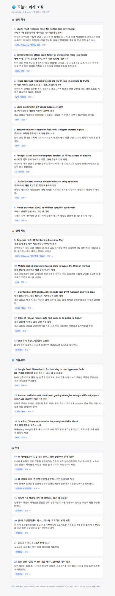

# 📰 daily-news

> 뉴스를 모아 **영어 원문 + 한국어 번역 + 요약**으로 정리하고, 날짜별 HTML 브리핑 파일로 저장하는 Claude Code 스킬.
>
> - **DAILY** — RSS 피드에서 오늘의 주요 세계 소식을 카테고리별로 (기본)
> - **TOPIC** — 특정 주제(인물·기업·국가·사건)만 RSS + 웹 검색으로 파고들기

---

## 설치

Claude Code 개인 스킬 폴더에 `daily-news` 디렉터리를 넣으면 끝. 재시작 없이 바로 인식됨.

```bash
# 이 저장소 기준
cp -r skills/daily-news ~/.claude/skills/
```

폴더 구성:

```
~/.claude/skills/daily-news/
├── SKILL.md      # 스킬 본체 (지침 + HTML 템플릿)
├── feeds.txt     # RSS 피드 목록 (여기만 고치면 소스 추가/삭제)
└── README.md
```

설치 확인: Claude Code에서 `/daily-news` 자동완성에 뜨면 성공.

---

## 사용법 (트리거 예시)

슬래시 커맨드로 직접 실행:

```
/daily-news
```

또는 자연어로 (스킬 설명에 매칭돼 자동 발동):

- `오늘 뉴스 정리해줘`
- `세계 소식 요약해줘`
- `daily news briefing`
- `오늘의 주요 소식 브리핑`

옵션도 자연어로 얹을 수 있음:

- `오늘 뉴스 정리하되 기술 뉴스만`
- `오늘 뉴스 20건으로 정리해줘`

### 🔎 주제 모드 (TOPIC)

특정 주제를 콕 집으면 그 주제만 파고드는 모드로 전환됨:

- `트럼프 관련 가장 최근 소식 다 정리해줘`
- `엔비디아 뉴스 모아서 요약해줘`
- `이번 주 우크라이나 상황 정리`
- `최근 한 달 금리 관련 소식`

RSS만으론 특정 주제 커버가 얇아서, 주제 모드는 **웹 검색까지 같이** 돌림.

---

## 두 가지 모드

| | **DAILY** (기본) | **TOPIC** (주제 지정 시) |
|---|---|---|
| 발동 | 주제 없이 "오늘 뉴스" | 주제를 말했을 때 |
| 수집 | `feeds.txt` RSS | RSS + 웹 검색 + 기사 본문 |
| 기간 | 최근 36시간 | 최근 7일 (말하면 조정) |
| 구성 | 고정 4카테고리 | 찾은 내용에서 뽑은 소주제 2~5개 |
| 건수 | 10건+ | 관련 있는 만큼 (보통 6~15) |
| 추가 | — | 맨 위 `핵심 요약` TL;DR |
| 파일명 | `YYYY-MM-DD.html` | `YYYY-MM-DD-트럼프.html` |

---

## 동작 (DAILY 기준)

1. 오늘 날짜 확인
2. `feeds.txt`의 RSS 피드 병렬 수집
3. 같은 사건 중복 제거
4. 카테고리별(정치·국제 / 경제·시장 / 기술·과학 / 국내) 상위 10건+ 선별
5. 각 건: 영어 원문 헤드라인 + 한국어 번역 + 2~3줄 한국어 요약 + 출처 링크
6. `YYYY-MM-DD.html` 파일로 저장

TOPIC 모드는 3번 앞에 "주제 검색어 3~6개 생성 → 웹 검색 → 주제 무관 기사 제거"가 붙고, 4번이 "소주제별 묶기"로 바뀜.

**저장 위치(고정):** `C:\Users\dladu\OneDrive\바탕 화면\daily new\`
(다른 경로로 바꾸려면 `SKILL.md`의 `Output dir (FIXED)` 한 줄 수정.)

---

## 실행 결과 예시

더블클릭하면 브라우저에서 열리는 카드형 HTML. 다크모드 자동 대응, "원문 →" 링크 클릭 가능.



> 위 스크린샷은 `2026-07-24` 브리핑 (12개 피드 · 22건).

---

## 소스 커스터마이징

`feeds.txt`에 한 줄씩 추가/삭제. 형식:

```
CATEGORY | Source Name | URL
```

예:

```
정치·국제 | BBC World | http://feeds.bbci.co.uk/news/world/rss.xml
국내      | 경향신문 정치 | https://www.khan.co.kr/rss/rssdata/politic_news.xml
```

**작동 확인된 피드:** BBC(World/Business/Technology), NPR World, CBS World, Al Jazeera, CNBC, 한국경제(정치/경제), 경향신문(정치/경제/전체)

**WebFetch가 차단하는 피드(추가 불가):** NYT, The Guardian, AP, Ars Technica, 한겨레, 연합뉴스, 동아, 매일경제, JTBC, 노컷뉴스, 한국일보, 오마이뉴스
(`feeds.txt` 상단 주석에도 목록 있음.)

> TOPIC 모드의 웹 검색은 `feeds.txt`에 묶이지 않음 — 차단된 매체 기사도 검색으로는 잡힐 수 있음.

---

## 참고

- 팩트는 수집한 소스 내용만 사용 — 헤드라인은 원문 그대로, 요약만 자체 작성.
- TOPIC 모드도 학습 지식으로 채우지 않음. 링크 없는 문장은 안 씀. 해당 기간에 소식이 없으면 "없음"이라고 말하고 끝냄.
- 매일 자동 실행은 미지원(클라우드 스케줄은 별도 설정 필요). 현재는 직접 `/daily-news` 실행 방식.
